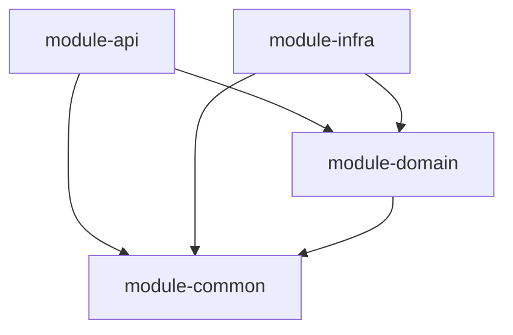

# Bank-System Backend - Step 1: 멀티 모듈 아키텍처 및 결제 도메인 설계

## 1. 개요 및 배경 (Context)
결제 서비스의 확장성, 도메인의 순수성 유지 및 유지보수성을 극대화하기 위해, 시스템 구조를 단일 모듈 대신 헥사고날 아키텍처(Ports and Adapters) 원칙을 적용한 멀티 모듈 구조로 구축합니다.

특히 비즈니스 로직이 특정 프레임워크(Spring)나 데이터베이스 기술(JPA/RDB)에 강하게 의존하지 않도록 분리하여, 순수한 Kotlin 코드로 도메인 모델을 보호하는 것이 핵심 목표입니다.

## 2. 결정 사항 (Decision)
시스템을 다음과 같이 4개의 핵심 모듈로 나누어 점진적으로 구축합니다.

### 2.1. 모듈 구성 및 의존성

1. **`module-common`**: 공통 유틸리티, 공통 에러 구조 등 프로젝트 전반에서 사용되는 코드 포함.
2. **`module-domain`**: 순수한 비즈니스 규칙과 엔티티 정의. Spring 등 외부 프레임워크 의존성을 완전히 배제한 **Pure Kotlin** 모듈.
3. **`module-infra`**: 데이터베이스(JPA/MySQL), 캐시 등 기술적 세부사항을 담당하는 어댑터(Adapter) 모듈.
4. **`module-api`**: 클라이언트 요청의 진입점(Controller/DTO) 및 스프링 부트 애플리케이션 시작점.

### 2.2. 결제 도메인 설계
- **`Payment`**: 결제 상태(`PENDING`, `SUCCESS`, `FAILED`, `CANCELLED`)를 관리하는 순수 도메인 객체.
- **`PaymentRepository`**: 영속성 처리를 위해 도메인 계층에 정의된 Port(인터페이스).
- **`PaymentRepositoryAdapter`**: 인프라 계층(`module-infra`)에서 `PaymentRepository` Port를 구현하고, 내부적으로 `PaymentJpaRepository`를 사용하여 JPA 엔티티와 도메인 엔티티 간 변환 수행.

## 3. 결과 및 영향 (Consequences)
- **장점**:
  - 데이터베이스나 외부 프레임워크 기술이 변경되어도 핵심 도메인 비즈니스 코드는 영향받지 않고 유지됩니다.
  - 모듈별 역할이 명확하게 격리되어 대규모 협업 및 모듈별 독립적인 테스트 작성이 편리합니다.
- **단점/고려사항**:
  - 도메인 엔티티(`Payment`)와 JPA 엔티티(`PaymentJpaEntity`)를 상호 변환(Mapping)해야 하므로 추가적인 보일러플레이트 코드가 발생합니다.
